# Serial Assignment System - Workflow Diagrams

## 1. Index Page Workflow

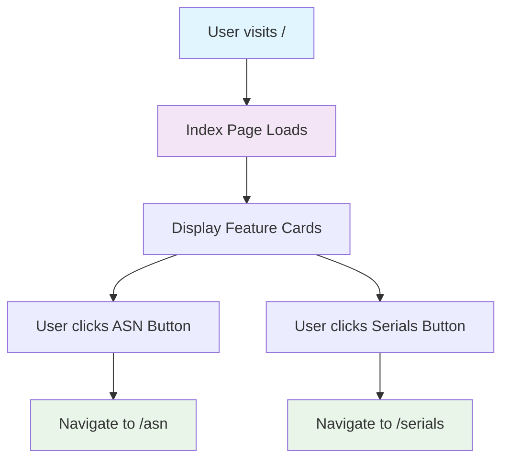

## 2. Serials Page Workflow

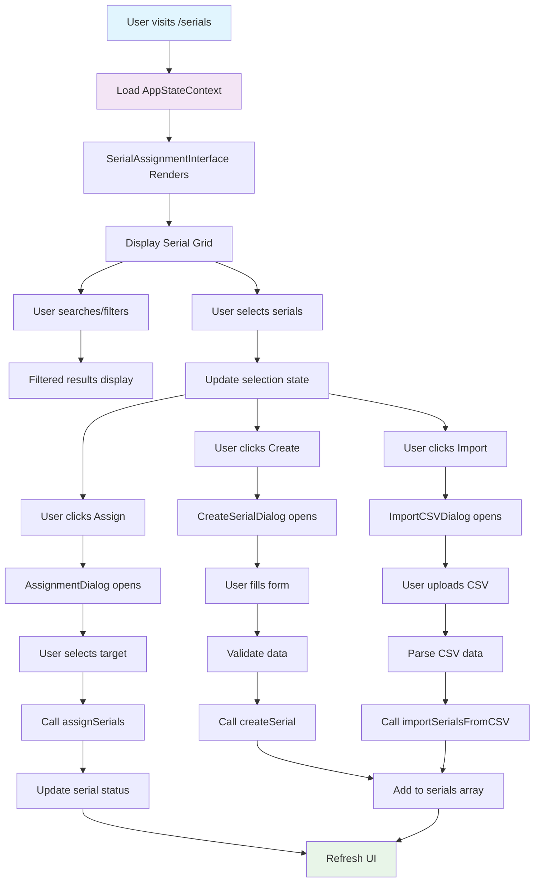

## 3. ASN Page Workflow

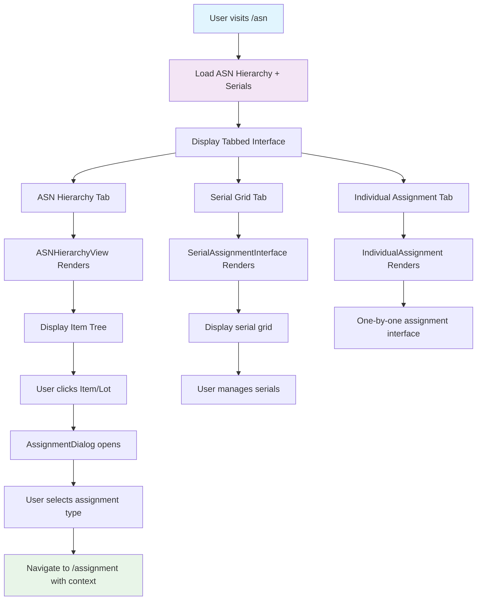

## 4. Assignment Page Workflow

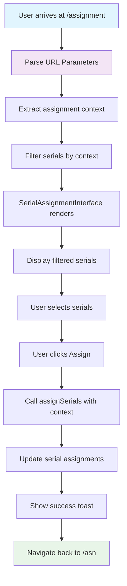

## 5. Serial Assignment Flow (Detailed)

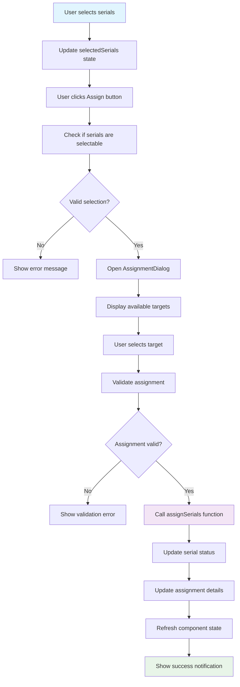

## 6. Serial Creation Flow

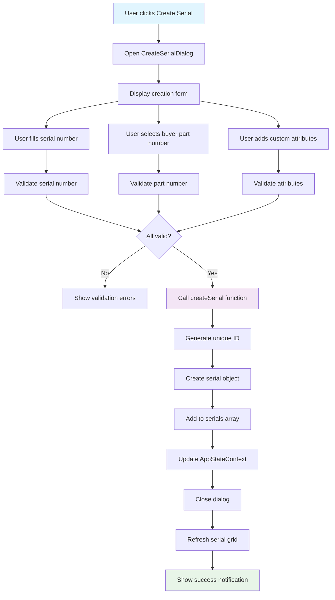

## 7. State Management Flow

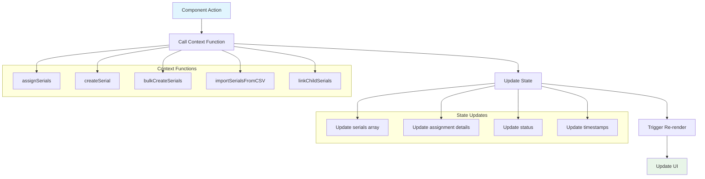

## 8. ASN Hierarchy Navigation Flow

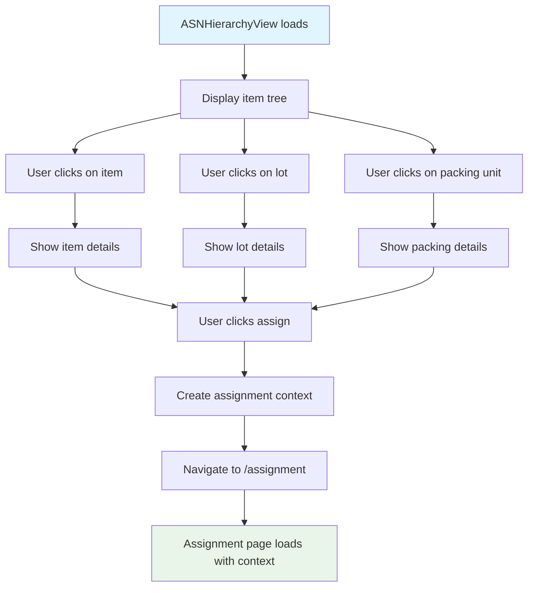

## 9. Bulk Operations Flow

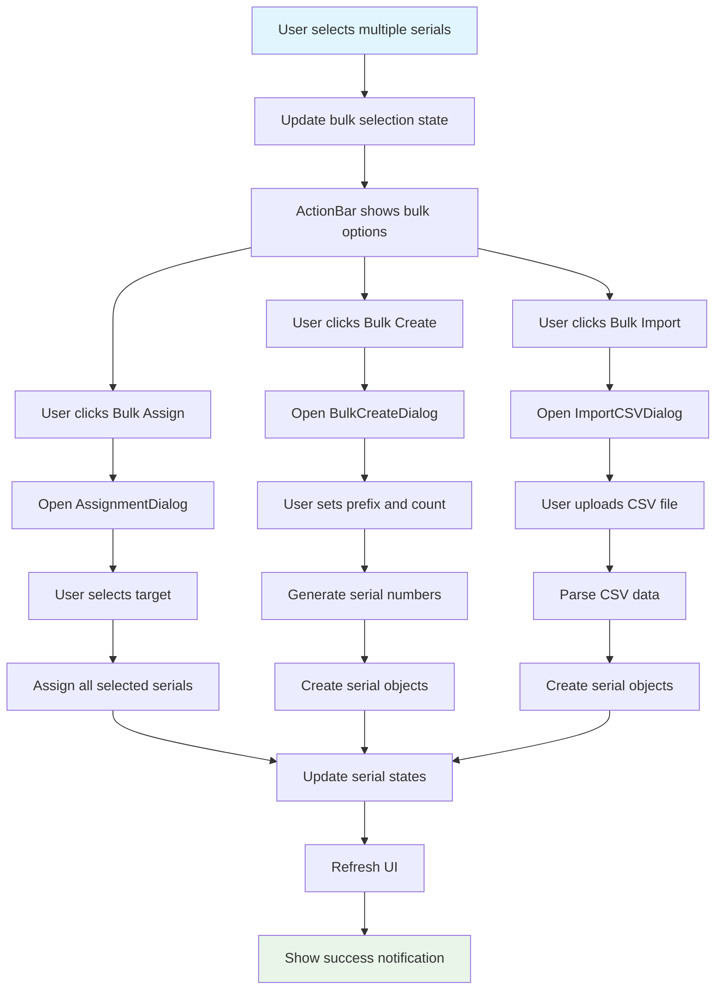

## 10. Error Handling Flow

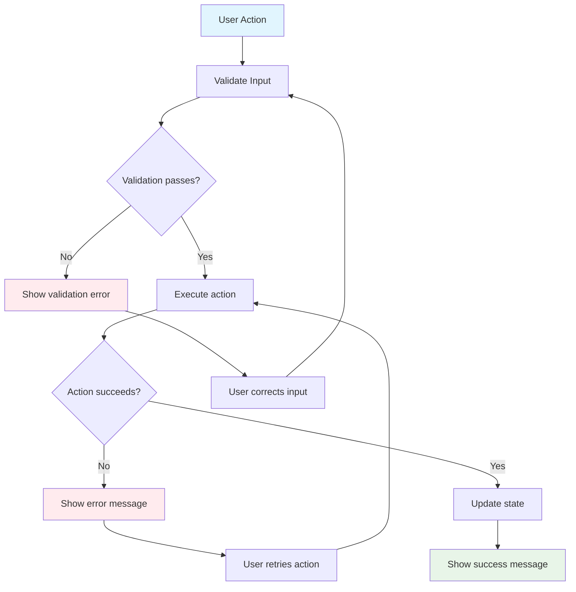

## Component Interaction Diagram

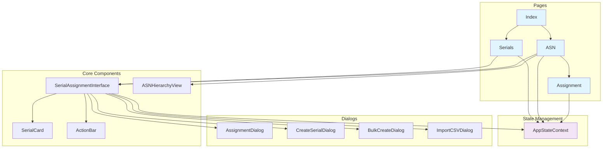